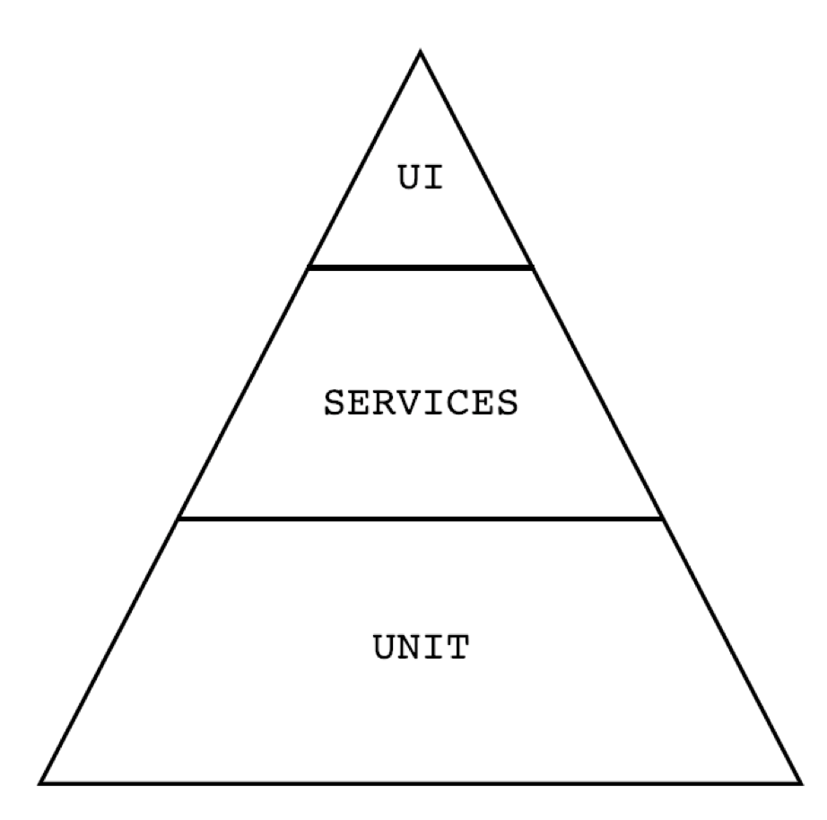

# Setting the Foundation Notes

## Designing a Test Automation Strategy

### The what
It's important to ask yourself **what** is the goal of the Testing Strategy, **what** do you want to accomplish? There might be different ideas in mind, such as:

- Maybe you want to reduce the Test Regression Cycle
- Perhaps you want to reduce the Technical Debt
- Or you want to *enable* continuous testing in your application

Whatever your goal is, it's important to understand what it is you're trying to accomplish. Decide why it is that you need Test Automation, and keep this in mind because your following actions should be aimed to this goal.

### The who
> *Who do you envision participating in your Test Automation initiative, and in what capacity?*

Since the developers are already working in bug fixes and delivering new features, and the manual testers are focused on testing, it's required to have someone that has the skills of both sides, this is where the **Test Automation Engineer** comes into play. 

Is critical to make this person a standar part of your team, because having him to collaborate and work with the other members of your team, will strenghten your test automation initiative.

### The how
> *How do you plan for the execution of your defined strategy?*

#### Planning
To automate tests, you need a clear understanding of the scenarios, actions, and expected results clearly defined. Having a guide to ensure nothing is missed is key, this guide could contain Acceptance criteria, Test Cases or Gherkin scenarios.

#### Implementation
You need to choose tooling for your automation project, such as the programming language. You need to develop standards and conventions, in case you'll have multiple contributors at a time.

#### Execution
When and how the tests will be executed. It's important to think what will be the conditions and scenarios that will require the code to be executed. This could be on a schedule, either daily or weekly, maybe you want them to get executed when a developer submits a Pull Request or even after a new release.

There are different levels of execution, which are as follows:
<dl>
    <dt>Locally</dt>
    <dd>Run the tests locally. Report to the team. This requires manual intervention, and therefore will be slower, but the report delivered to the team has already been triaged and can be trusted to be accurate.</dd>
    <dt>Separate Build</dt>
    <dd>Running the jobs in a CI Jobs, separate from development, gives a quicker feedback, but the reported results haven't been triaged and the Tests need to be written with a higher level of proficiency, to ensure consistency and trust.</dd>
    <dt>Developer Build</dt>
    <dd>Requires fast and reliable tests, that will only fail when the application under test has provoked it..</dd>
</dl>

The recommendation is to slowly move from the bottom to the top, to get comfortable with the testing experience and it's pros and cons.

## Creating a Culture for Test Automation

Test Automation is most successful when there is collaboration amongst different team members, from PO's all the way to the developers and testers.

Let's remember that is very important to communicate the goal of your test automation and make sure **everyone** understands what's needed to accomplish that goal, and more importantly, the role they play in the success of this goal.

#### Product Owner / Business Analyst
- They can provide business context to the features that are developed, and also can do the same for related tests.
- Insight of which tests provide the most value, and therefore should be automated.
- When the PO understands the goal and purpose of automation, they will be a key advocate in pushing for the health of the automated tests.

#### Developers
- They usually receive the most benefit of automation.
- They are able to move a lot faster with their feature development, because they don't need to be as fearful about the impact their code may cause to the existing codebase.
- Developers should contribute with unit tests, which are small tests that test the lofic of individual functions.

#### Testers
- Testers will always be needed, even with a successful automation framework.
- Testers are required to explore and thoroughly interrogate your applications.
- They will discover the most costly bugs.
- They can provide valuable insight of the tests that are best to automate, and areas of the application that may need the most coverage.

### Developing for Test Automatability

Mike cohn introduced the Test Automation pyramid, which is a model that describes three levels in which tests can be automated against: unit, services, and UI.

